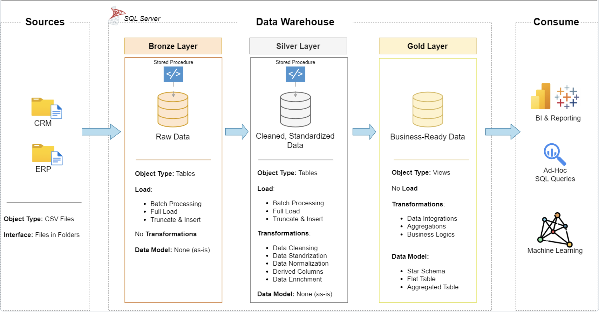
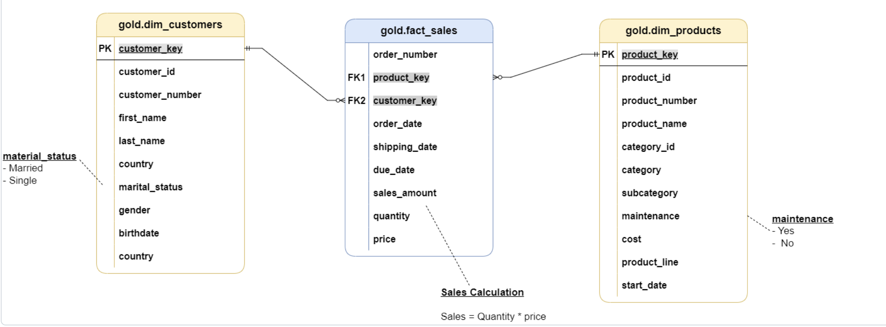

# 🏗️ SQL Server Data Warehouse

A batch warehouse that integrates CRM and ERP extracts through Bronze, Silver, and Gold layers in SQL Server.

## Business need

Reporting directly from operational extracts creates repeated cleansing logic and inconsistent definitions. This warehouse preserves the source records, standardizes shared entities, and publishes a small dimensional model for sales analysis.

## Data flow

```text
CRM and ERP CSV files
          ↓
Bronze: source-aligned tables
          ↓
Silver: types, cleaning, deduplication, integration
          ↓
Gold: customer and product dimensions + sales fact
          ↓
SQL quality checks and analytical queries
```



## Implemented methodology

| Layer | Responsibility |
|---|---|
| Bronze | Full-refresh ingestion of six checked-in CSV files |
| Silver | Standardization, date validation, deduplication, and identifier alignment |
| Gold | Star-schema views with surrogate keys |
| Tests | Duplicate, null, domain, date, measure, and referential checks |



## Repository layout

```text
datasets/                 source CRM and ERP extracts
scripts/int_database.sql  destructive database bootstrap
scripts/bronze/           source tables and loader
scripts/silver/           cleaned tables and transformations
scripts/gold/             dimensions and fact view
scripts/run_pipeline.sql  sqlcmd entry point
tests/                    Silver and Gold quality queries
```

## Run the warehouse

Prerequisites:

- SQL Server 2019 or later
- `sqlcmd`
- a SQL Server service account that can read the dataset directory

The bootstrap script drops and recreates `DataWarehouse`. Do not use it against an environment containing data you need.

From the repository root:

```bash
sqlcmd -S localhost -E -v DatasetRoot="/absolute/path/to/sql_datawarehouse_project/datasets" -i scripts/run_pipeline.sql
```

Use `-U` and `-P` instead of `-E` when SQL authentication is required. `DatasetRoot` is substituted into the six `BULK INSERT` paths. On Linux containers, mount the repository directory into SQL Server and pass the path visible inside that container.

## Validation

```bash
python scripts/validate_project.py
```

The dependency-free validator checks required artifacts, layer references, source-file/path agreement, rerunnable Bronze table guards, and README contracts. The SQL quality files must also be executed against the loaded warehouse; CI does not start SQL Server and does not claim an integration run.

A successful database run has:

- six non-empty Bronze and Silver source tables
- unique customer and product dimension keys
- no unresolved fact foreign keys
- valid sales, quantity, price, and date relationships
- zero defect rows returned by the quality queries

## Results

The Gold layer exposes `gold.dim_customers`, `gold.dim_products`, and `gold.fact_sales`. These are implementation outputs from the bundled sample extracts, not production business results.

## Limitations

Loads are destructive full refreshes. The project does not implement incremental watermarks, slowly changing dimensions, orchestration, secrets management, or warehouse observability.
